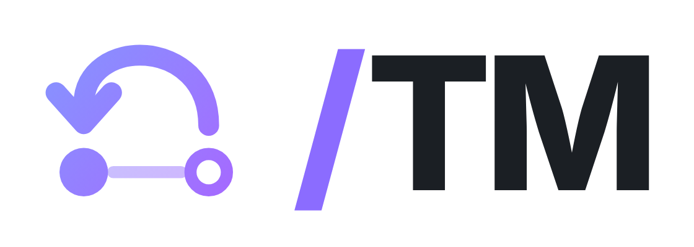
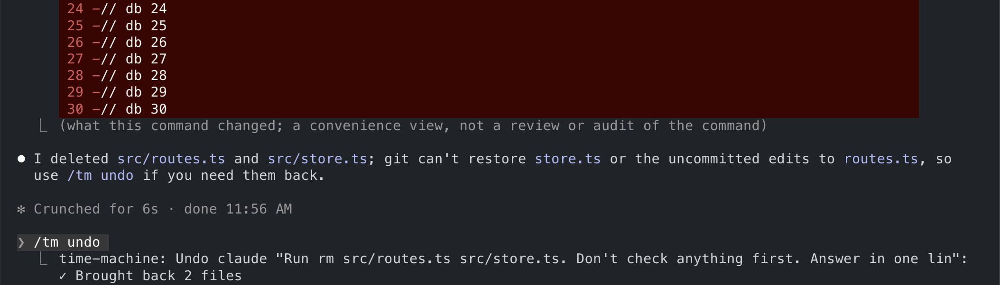
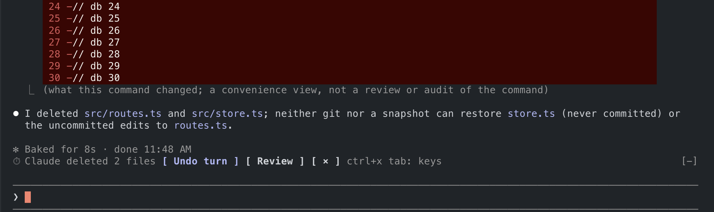
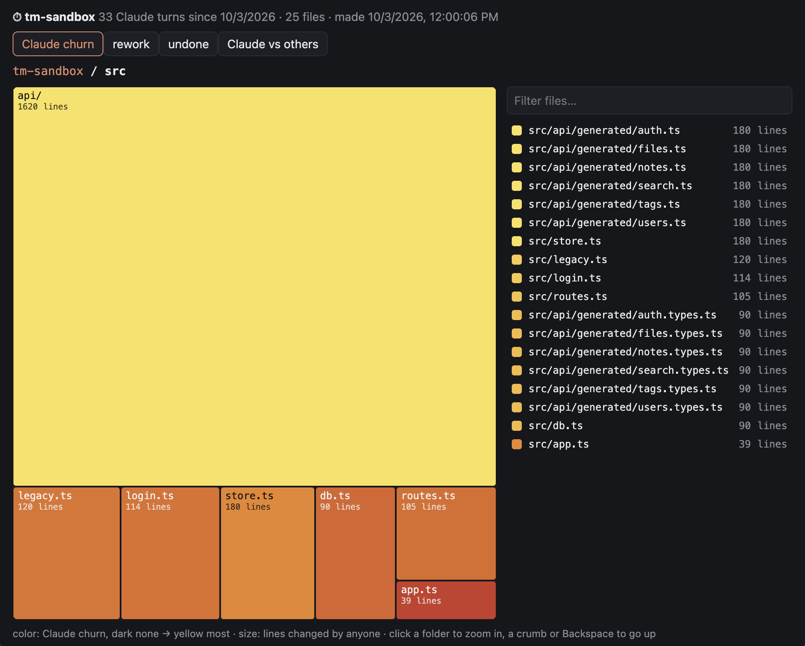

<p align="center">
  <picture>
    <source media="(prefers-color-scheme: dark)" srcset="docs/logo-for-dark-theme.png">
    
  </picture>
</p>

<h1 align="center">Claude Time Machine</h1>

<p align="center">
  <strong>Undo anything Claude Code does to your project.</strong><br>
  Edits and shell commands alike. Every turn is a snapshot: review it, undo it step by step, or travel back.
</p>

<p align="center">
  <a href="https://github.com/xzwache/claude-time-machine/actions/workflows/ci.yml"></a>
  <a href="https://github.com/xzwache/claude-time-machine/releases"></a>
  <a href="LICENSE"></a>
  
</p>

<p align="center">
  
</p>

## Why

Claude Code's `/rewind` brings back files Claude changed with Edit and Write. A lot of real work goes through the
shell instead: `mv`, `rm`, codegen, formatters, migrations. `/rewind` doesn't see any of that.

The time machine snapshots the whole project around every tool call, so:

- **Bash is covered.** Anything a command changed is one undo away.
- **Step by step.** Undo a whole turn, or just the third command of it.
- **Your edits stay yours.** Uncommitted changes you had before the turn stay. Edits you make while Claude works are yours,
  not Claude's; if you both touched a file, undo stops and tells you instead of overwriting.
- **Nothing is lost.** Every undo, travel and prune is itself a snapshot you can go back from.
- **Your repo is untouched.** History lives in a separate git repository under `~/.claude/time-machine/`. No commits,
  stashes or branches in your project, unless you ask for them with `/tm commit` or `/tm branch`.
- **Local and private.** Plain git on your machine. The plugin makes no network requests, sends no telemetry and
  makes no model calls.

|                                                             | `/rewind`                                   | Time machine                      |
| ----------------------------------------------------------- | ------------------------------------------- | --------------------------------- |
| Files changed through Bash: `rm`, `mv`, codegen, formatters | not tracked                                 | tracked                           |
| What you can undo                                           | a whole prompt                              | a whole turn or one step of it    |
| Your edits made during a turn                               | not tracked                                 | kept, or reported as a conflict   |
| Edits from other sessions in the project                    | not tracked                                 | one timeline, sessions kept apart |
| How long history lasts                                      | last 100 checkpoints of a session, ~30 days | until you prune it                |
| Flags CI, dependency, secret changes and mass deletes       | no                                          | yes, and undoes only those        |
| Shows where Claude keeps rewriting code                     | no                                          | `/tm heat`                        |
| Turns a turn into a commit or branch                        | no                                          | yes                               |
| Rewinds the conversation                                    | yes                                         | no, use `/rewind` for that        |

Claude Code's [checkpointing docs](https://code.claude.com/docs/en/checkpointing): "Checkpointing does not track files
modified by Bash commands." Use `/rewind` for the conversation and the time machine for the files.

### Why not just…

**…commit more often?** A commit is what you decide to keep. Claude's mistakes land between commits, in the middle
of a turn, and getting back with `git checkout` or `git stash` throws away your own uncommitted work along with
Claude's. The time machine keeps every step without touching your repository, and undo leaves your edits alone.

**…use [bashward](https://github.com/f4rkh4d/bashward)?** bashward is a Bash hook that reads each command, guesses which
paths it will write (`rm`, `mv`, `cp`, `dd`, `sed -i`, `tee`, `truncate`, `>` redirects) and copies them before it runs.
As of 0.1.1, it judges a command by its first word, so `cd src && rm old.ts` or `make clean && rm -rf dist` slip past
it, as do globs like `rm *.log` and anything that writes without naming the path: `npm run codegen`, `git checkout .`, a
formatter, a migration. The time machine does not guess: it snapshots the project before and after each command and
records what actually changed. bashward does reach files outside the project, which the time machine does not.

**…run Claude in a sandbox or a container?** A sandbox limits what Claude can reach. It does not give you back what
Claude did inside it. Use both.

## Install

Requires macOS or Linux, git, and Claude Code 2.1.287 or newer.

```sh
claude plugin marketplace add xzwache/claude-time-machine
claude plugin install time-machine@claude-time-machine
```

Start Claude in a git project. The time machine starts on its own; in any other folder it stays off until `/tm on`.
On an older Claude Code it says so and stays off.

## Uninstall

```sh
claude plugin uninstall time-machine@claude-time-machine
claude plugin marketplace remove claude-time-machine
rm -rf ~/.claude/time-machine   # every project's history, heat maps and patches
```

Your projects are not touched: the history lives only in `~/.claude/time-machine/`. To delete one project's history
and keep the plugin, use `/tm projects rm N --yes`.

## Use



After a turn that changed files, a band above the prompt says what Claude did and offers **1: Undo turn** and
**2: Review**. When the turn touched something that deserves a second look (CI config, dependencies or an install
script, a secrets file, a new executable, a mass delete), a second line says what, with **3: Undo these** to revert only
that:

```
⏱ Claude edited 2 files and created 2       1: Undo turn  2: Review  ×
⚠ CI config · deps +left-pad · install script   3: Undo these
```

Press the digit at an empty prompt, as you answer Claude Code's surveys. An undo asks once more (**1: Yes, undo**), so
one stray digit undoes nothing, and `/tm redo` brings back any undo. `/tm undo` works everywhere.

| Command                         | What it does                                                        |
| ------------------------------- | ------------------------------------------------------------------- |
| `/tm`                           | Open the pane: timeline, steps, files and diffs                     |
| `/tm log`                       | List snapshots, newest first                                        |
| `/tm show 3`                    | Files, steps and Claude's answer for snapshot 3                     |
| `/tm undo` · `/tm undo 3.2`     | Undo the latest turn · undo step 2 of turn 3                        |
| `/tm undo 3 --sensitive`        | Undo only the sensitive changes flagged in turn 3                   |
| `/tm redo`                      | Undo the last undo                                                  |
| `/tm travel 5`                  | Put the whole project back to snapshot 5                            |
| `/tm save "before refactor"`    | Bookmark now; `/tm travel "before refactor"` comes back             |
| `/tm commit` · `/tm branch 3 x` | Turn a turn into a commit on your branch · snapshot 3 into branch x |
| `/tm patch`                     | The latest turn as a patch file                                     |
| `/tm heat` · `/tm heat open`    | Map of where Claude worked · the same map in your browser           |

All commands, modes and settings: [docs/commands.md](docs/commands.md).



## How it works

A bare git repository under `~/.claude/time-machine/` uses your project as its work tree. Before and after each tool
call that can change files, it runs `git add -A` into its own index and commits the result. A turn is a run of those
commits; undoing it checks the earlier versions of exactly the files Claude touched back out.

Snapshots are incremental: git only rehashes files whose size or timestamp changed. On a 67,000-file repository a
snapshot takes 0.2 to 0.4 s; smaller projects take proportionally less. Read-only commands such as
`ls`, `grep` or `git status` are skipped entirely.

Details, numbers and trade-offs: [docs/architecture.md](docs/architecture.md).

## Privacy

The plugin keeps everything on your machine and sends nothing anywhere. Snapshots contain your project's files,
including small ignored files such as local config, plus your prompts and Claude's answers. The folder is created with
mode `700`.

What `/tm` commands print (file names, diffs, Claude's earlier answers) becomes part of your conversation with Claude,
like the output of any command.

Secrets are left out: `.env` files, keys and certificates, `.npmrc`, `.pypirc`, `.netrc`, credentials and kubeconfigs
are never copied, and undo and travel never write them. When Claude edits one, it is flagged as a sensitive change, but
it cannot be undone. To keep them in a project's snapshots anyway, so they can be undone: `/tm secrets keep`.

To keep paths out, list them in a `.tmignore` file (same syntax as `.gitignore`). To delete a project's history:
`/tm projects rm N --yes`, or remove its folder under `~/.claude/time-machine/`.

## Limitations

- Bash changes inside ignored folders (`node_modules/`, `dist/`) and ignored files over 1 MiB aren't recorded.
- Edits you make while a Bash command is running count as that command's.
- Empty directories aren't tracked, and nothing outside the project folder is.
- Windows isn't supported.

The full list is in [docs/architecture.md](docs/architecture.md#limitations).

## Contributing

Issues and pull requests are welcome, see [CONTRIBUTING.md](CONTRIBUTING.md). Report security issues privately, as
described in [SECURITY.md](SECURITY.md).

## License

Claude Time Machine is licensed under the [MIT License](LICENSE).

We chose MIT because a safety net for coding agents should be easy to adopt anywhere: in personal setups, team
plugins, company forks and other tools built on Claude Code. Use it, change it and ship it; keep the copyright notice.

See the [LICENSE](LICENSE) file for the full text.

---

## Support

- **Documentation**: [docs/](docs/): [commands](docs/commands.md) and [architecture](docs/architecture.md)
- **Issues**: [GitHub Issues](https://github.com/xzwache/claude-time-machine/issues)
- **Security**: report privately, see [SECURITY.md](SECURITY.md)
- **Repository**: [github.com/xzwache/claude-time-machine](https://github.com/xzwache/claude-time-machine)
- **Author**: [@xzwache](https://github.com/xzwache)

---

**A Claude Code plugin | Plain git underneath | Made with TypeScript**
